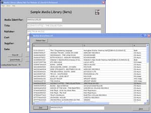



## Media Library Sample \(using Binary Search Tree Node Class as database engine\)

### Description

A 'vanilla' Media Library application sample to store, maintain and review CDs,DVDs,Books in a Media Library by barcode or unique media key. It's unique in that it is using a Binary Search Tree Nodes Class - an effective and very fast searching/database storage methodology. This is a self-contained binary tree class along with a non-gui listbox class to create, search and maintain any unique key data in a binary tree. A lot of databases use this methodology as the basis for their database engines. Now you can have the database power inside your application. For example, a search of 3,000 keys will only require an average of 7-11 tree visits/seeks regardless of the key your are trying to locate. Also included are member routines to output all the data keys in tree in alpha order or even in reverse alpha order. This has been extensively tested for reliabilty and fast response for searching, insertions, deletions and traversals of tree nodes in general. Included root node release, tree re-balancing and garbage threshold detection and collection. Also extensive notes and a built-in commented example project/form to build a couple of example binary trees which output to a gui listbox. Also to demonstrate some of the class member functions usage. You may be surprised to learn there is little emphasis on recursion so no worries of runaway stack levels. (c) David K Richmond
 
### More Info
 
Contains a sample database file of 75 real-life examples of CDs, DVDs books etc.

try looking on google.com for binary trees for detailed explanation of binary search algorithms.

             |
---                |---
**Submitted On**   |2005-05-04 08:34:10
**By**             |[David K Richmond](https://github.com/Planet-Source-Code/PSCIndex/blob/master/ByAuthor/david-k-richmond.md)
**Level**          |Beginner
**User Rating**    |5.0 (30 globes from 6 users)
**Compatibility**  |VB 6\.0
**Category**       |[Databases/ Data Access/ DAO/ ADO](https://github.com/Planet-Source-Code/PSCIndex/blob/master/ByCategory/databases-data-access-dao-ado__1-6.md)
**World**          |[Visual Basic](https://github.com/Planet-Source-Code/PSCIndex/blob/master/ByWorld/visual-basic.md)
**Archive File**   |[Media\_Libr188493552005\.zip](https://github.com/Planet-Source-Code/david-k-richmond-media-library-sample-using-binary-search-tree-node-class-as-database-engi__1-60381/archive/master.zip)

